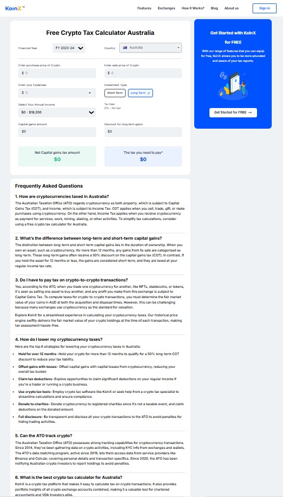

# 🧮 Crypto Tax Calculator - Australia 🇦🇺

A single-page **Crypto Tax Calculator** built with **Vite + React + Tailwind CSS**. This application calculates your **Capital Gains Tax** in Australia based on sale, purchase, and income values using the Australian tax brackets.

The project is built using React.js and draws inspiration from the Figma design, accessible [here](https://www.figma.com/design/i3FdVKzpJartzU5r1FNkfz/KoinX-Crypto-Tax-Calculator---Assignment?node-id=0-60&t=6wuRyM37394ZKm08-0).

---

## 📸 Screenshots

### 🖥️ Desktop View



### 📱 Mobile View

 |

---

## 📝 Task Overview

This project is part of the **Frontend Interview Task for KoinX**, where the goal was to convert a Figma UI into a functional, responsive SPA that computes crypto capital gains and tax amounts according to Australia's taxation rules.

---

## ✅ Functionalities Implemented

- 🎯 **Capital Gains Calculation**

  - `Capital Gains = Sale Price - Purchase Price - Expenses`

- 🔁 **Investment Type Handling**

  - Long Term → 50% discount on capital gains
  - Short Term → No discount, result panel changes accordingly

- 💸 **Australian Tax Rate Logic**

  - Tax brackets implemented using conditionals and shown dynamically
  - Calculation based on:
    ```js
    Tax = BaseTax + (NetGains * TaxRate%)
    ```

- ⬇️ **Annual Income Dropdown**

  - Dynamically displays correct tax bracket description

- 🎨 **Responsive UI**

  - Fully responsive: adjusts to mobile/tablet screens

- ✅ **Form Validations & UX Enhancements**
  - Input validations for negative numbers
  - Real-time updates on result section

---

## 📦 Tech Stack & Packages

- **React** (via Vite)
- **Tailwind CSS** (Utility-first styling)
- **react-icons** (for icons)

### Folder Structure

```bash

├── assets/ # All images, logo
├── components/ # All components
├── pages/ # All page
├── utils/ # Tax bracket logic & data
├── App.jsx
├── main.jsx
└── index.css

```

---

## 📚 Learnings

- Implementing real-world **financial calculations** using JavaScript
- Creating **conditionally rendered** UI blocks based on user input
- Tailwind CSS for **quick prototyping** and pixel-perfect styling
- How to structure a **scalable React project**
- Responsive layouts using **flex/grid utilities**

---

## 🚀 Future Improvements

- Add **multi-country support**
- Include **FAQ section** dynamically from an array (optional task)
- Integrate **form validation libraries** (like React Hook Form or Yup)
- Save user data locally (using `localStorage` or `context`)
- Add **unit tests** for calculation logic

---

## 🔗 Live Demo & GitHub

- 🔗 **Live Site:** [View on Netlify](https://tax-calculator-koinx.netlify.app/)
- 💻 **GitHub Repo:** [View Repository](https://github.com/praveen00219/Koinx-Free-Crypto-Tax-Calculator)

---

> © 2025 | Built with ❤️ by Praveen
